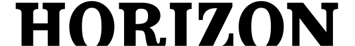
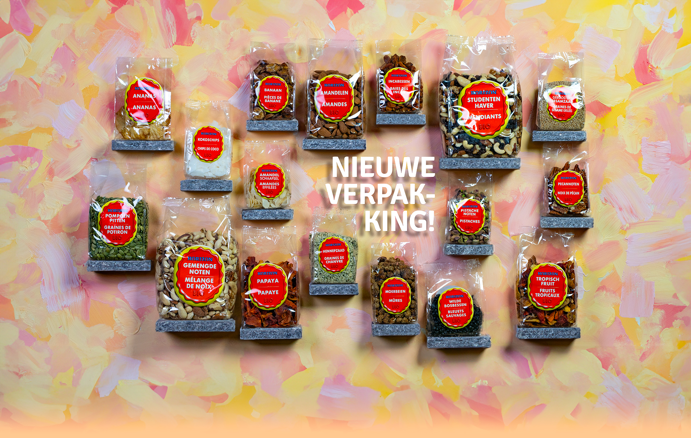
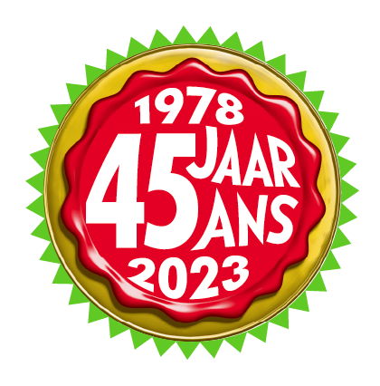
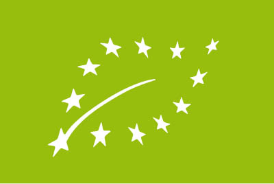

# Claude Code Prompt — Horizon Natuurvoeding Website

> Kopieer alles hieronder en plak het als prompt in Claude Code.

---

## OPDRACHT

Bouw een volledige, productie-waardige statische HTML-website voor **Horizon Natuurvoeding** — een Nederlands biologisch voedingsbedrijf opgericht in 1978. De site is primair een **B2B communicatieplatform** (retailers, distributeurs, partners) met een secundaire doelgroep van bewuste consumenten.

De website bestaat uit één HTML-bestand (`index.html`). Alle CSS en JavaScript staan inline in dat bestand. Geen externe frameworks zoals Bootstrap of Tailwind — pure CSS.

---

## CONTEXT: WAAR DE SITE VOOR DIENT

Horizon Natuurvoeding is de **strategische moederorganisatie** achter vier consumentenmerken: Horizon, Monki, Jori en Krekeltje. De website is geen webshop en geen consumentenmerk. Het is het podium waarmee Horizon zich presenteert aan:

1. **Retailers** (biologische winkels, supermarkten) die het assortiment willen voeren
2. **Distributeurs** die willen samenwerken
3. **Food service** (restaurants, catering) die transparantie eisen
4. **Consumenten** die willen weten wie achter hun favoriete merk zit

De centrale boodschap van het merk: **"Samen bereiken we 'm wel!"** — pragmatisch optimisme, geen hype.

---

## BRAND SYSTEM — EXACTE WAARDEN

### Kleuren (gebruik EXACT deze hex-waarden)

```
--color-blue:     #00AEEF   /* Horizon Blauw — primaire kleur, logo, headlines, CTAs */
--color-cream:    #FAF0DC   /* Horizon Crème — achtergrond, "de aarde" */
--color-navy:     #003A5C   /* Donker Navy — body text, footer achtergrond */
--color-sky:      #B8E8F5   /* Hemelsblauw — gradient midden, lichte accenten */
--color-green:    #4CAF50   /* Bio Groen — badges, labels, certification icons */
--color-dark:     #272526   /* Near-black — kleine tekst, subtitles */
```

### Het Horizon Gradient (SIGNATURE ELEMENT — gebruik overal)

```css
background: linear-gradient(180deg, #FAF0DC 0%, #B8E8F5 45%, #00AEEF 100%);
```

Dit gradient is het visuele DNA van het merk. Crème (lucht/droom) bovenin, intens blauw (aarde/daad) onderin. De "horizon" is het snijvlak — precies waar droom en werkelijkheid samenkomen. Dit gradient moet aanwezig zijn in de hero en als subtiele sectie-overgang.

### Typografie

```
Headline font:  'Zilla Slab', serif  — weight 700 of 900, ALL CAPS
Body font:      'DM Sans', sans-serif — weight 400 of 500
```

Google Fonts import:
```html
<link href="https://fonts.googleapis.com/css2?family=Zilla+Slab:wght@400;700;900&family=DM+Sans:wght@400;500&display=swap" rel="stylesheet">
```

**Typografie-regels:**
- H1/H2 headlines: ALTIJD ALL CAPS + Zilla Slab
- Grote headlines gebruiken `font-size: clamp()` voor responsiviteit
- Subtitles en labels: `letter-spacing: 0.15–0.25em`, uppercase, DM Sans
- Body: gewone leesbare tekst, geen franje
- Letter-spacing op grote koppen: licht negatief (`letter-spacing: -2px` op display grootte)

---

## ASSETS — BESCHIKBARE BESTANDEN

De volgende bestanden staan in de map `assets/images/`:

| Bestand | Wat het is | Gebruik |
|---------|-----------|---------|
| `hornavologo.svg` | Echt brand logo — "HORIZON" wordmark met horizontale lijn en "NATUURVOEDING" ondertitel | Nav (klein), footer (groot) |
| `blokzak-home-nl.jpg` | Hoofdproduct hero image — productverpakking op brand gradient achtergrond, 1920x1219px | Hero sectie OF product showcase |
| `45-jaar-horizon.png` | 45-jaar jubileum badge, 420x426px, met alpha | Trust strip OF over ons sectie |
| `EUBio.jpg` | EU Biologisch certificeringsbadge | Trust strip, footer |
| `FaviconRound.png` | Brand favicon | `<link rel="icon">` in `<head>` |

**Logo-technische details:** Het SVG heeft `viewBox="0 0 595.28 121.32"` — een breed horizontaal formaat. In de nav: max-height 40px, width auto. De fill is `#3795d5` (iets donkerder blauw dan #00AEEF — gebruik zoals het is, niet aanpassen).

---

## WEBSITE STRUCTUUR

### 1. Navigation (sticky)

- Achtergrond: `rgba(255, 255, 255, 0.95)` met `backdrop-filter: blur(10px)`
- Links: Ons Verhaal, Merken, Samenwerken, Contact
- CTA button rechtsboven: **"Praat met ons →"** (NIET "Neem contact op")
- Logo: gebruik `hornavologo.svg` inline SVG of `` tag, max-height 36px

### 2. Hero Sectie — HOOFDKEUZE: Typografisch Manifesto

De hero is de **star of the show**. Gebruik het signature horizon gradient als achtergrond. Grote ALL CAPS Zilla Slab koppen gestapeld boven elkaar:

```
SAMEN
BEREIKEN
WE 'M WEL.
```

- Font-size: `clamp(4.5rem, 10vw, 9rem)`, weight 900, letter-spacing -3px
- Kleuren: wissel tussen `#FAF0DC` en `#00AEEF` per regel voor contrast op de gradient
  - "SAMEN" → `#FAF0DC`
  - "BEREIKEN" → `#00AEEF`  
  - "WE 'M WEL." → `#FAF0DC`
- Staggered CSS animatie: elke regel fadeInUp met 0.3s delay per regel
- Subtitle eronder: *"100% biologisch voor 100% van iedereen. Sinds 1978."* — DM Sans, klein, `#003A5C`
- CTA button: **"Laten we groeien →"**

**Animatie voor hero headlines:**
```css
@keyframes fadeInUp {
  from { opacity: 0; transform: translateY(30px); }
  to { opacity: 1; transform: translateY(0); }
}
```

### 3. Trust Strip

Dunne balk direct onder de hero, `background: #FAF0DC`:

```
1978 · SKAL gecertificeerd · IJsselstein · 4 merken · 30+ medewerkers
```

Inclusief `EUBio.jpg` als klein inline logo en `45-jaar-horizon.png` badge aan de rechterkant. Letter-spacing: 2px, uppercase, 0.85rem.

### 4. Over Ons / Quote Sectie

2-koloms grid (1fr 1fr), `background: #FAF0DC`:

**Links:** Grote blockquote in Zilla Slab, kleur `#00AEEF`:
> "Geen water bij de wijn."

**Rechts:** Body tekst in DM Sans, `#003A5C`:
> We bouwen geen concessies. Sinds 1978 werken we met dezelfde boeren, dezelfde kwaliteitseisen, dezelfde visie. Biologisch voedsel is niet een trend voor ons — het is de enige manier.
> 
> Vier merken. Een missie. Samen maken we biologisch de norm.

### 5. Vijf Merkwaarden

Sectie `background: #003A5C` (donker navy), tekst `#FAF0DC`:

Titel: **"WAT ONS DRIJFT"** — Zilla Slab, wit

5 waarden als cards of horizontal strip:
1. **INTEGER** — We doen wat we zeggen. Geen verborgen agenda's.
2. **PUUR** — Zonder onnodige toevoegingen. In product én communicatie.
3. **AUTONOOM** — Geen trends, geen conventies. Eigenzinnig Gronings.
4. **EARTHED** — Beide benen op de grond. Praktisch, menselijk.
5. **UTOPISTISCH** — Groot dromen, maar woorden die aanzetten tot doen.

### 6. Vier Merken Sectie

Sectie `background: #00AEEF` (brand blauw), tekst `#FAF0DC`:

Titel: **"VIER MERKEN. ÉÉN MISSIE."**

4 cards, `background: #FAF0DC`, kleur `#00AEEF`:

| Naam | Omschrijving |
|------|-------------|
| **HORIZON** | Het oorspronkelijke. Puur biologisch. Voor iedereen die eerlijk wil eten. |
| **MONKI** | Fruit en groenteproducten. Direct van de boer. Altijd vers, altijd biologisch. |
| **JORI** | Kruiden en specerijen. Eerlijk ingekocht. Echt goed. Direct in je keuken. |
| **KREKELTJE** | Voor de kleine dingen. Voor kinderen. Voor gezinnen. Puur genot. |

Elke card: merknaam in Zilla Slab groot, body in DM Sans, link "Bekijk →"

### 7. B2B Sectie — KRITISCH

Dit ontbreekt volledig op de huidige site. Gebruik gradient achtergrond (`linear-gradient(135deg, #B8E8F5 0%, #00AEEF 100%)`):

Titel: **"WIL JE ONS ASSORTIMENT VOEREN?"**

3 kolommen:
- **WINKELS** — Voeg biologische zekerheid toe aan je assortiment. Sterke merken. Loyale klanten.
- **DISTRIBUTEURS** — Een partner die je snapt. Eerlijke marges. Sterke support.
- **FOOD SERVICE** — Restaurants en catering verdienen transparantie. Dat geven wij. Vanaf dag één.

CTA: **"Praat met ons →"** (button, `background: #FAF0DC`, `color: #00AEEF`)

### 8. Product Showcase

Gebruik `blokzak-home-nl.jpg` als breed hero-achtig beeld hier — full-width img of als section background, met daarboven de tekst:

> **"WAT EROP STAAT, ZIT ERIN."**
> 
> Roosteren, malen en klaar. 100% voedzaam, 0% onnodige toevoegingen.

### 9. Footer

`background: #003A5C`, tekst `#FAF0DC`:

- Logo: `hornavologo.svg` groot (height 60px), gefilterd op wit indien nodig
- Tagline: "Samen bereiken we 'm wel!"
- Adres: Fannius Scholtenstraat 61B, 1051 EV Amsterdam
- Contact: (email en telefoon placeholder)
- Links: Instagram, LinkedIn, Email
- Copyright: © 2026 Horizon Natuurvoeding. Alles biologisch.
- `EUBio.jpg` badge onderin

---

## TONE OF VOICE — WAT WE NIET ZEGGEN

Dit is een nuchter, eigenzinnig merk. **Vermijd:**
- "Wij zijn een revolutie in biologisch eten!"
- "Onze producten zijn speciaal ontwikkeld voor bewuste consumenten."
- "Wij garanderen de beste kwaliteit."
- Hyperbolen, superlatieven, of inspirational bullshit

**Schrijf zo:**
- "Wat erop staat, zit erin. Niks meer, niks minder."
- "100% Voedzaam, 0% Onnodige toevoegingen."
- "We werken al generaties met dezelfde boeren."
- "Geen water bij de wijn."

**CTA taal:**
- ❌ "Meer informatie" → ✅ "Bekijk het assortiment"
- ❌ "Ontdek onze producten" → ✅ "Zien wat we maken?"
- ❌ "Neem contact op" → ✅ "Praat met ons"
- ❌ "Lees meer" → ✅ "Het hele verhaal"

---

## TECHNISCHE VEREISTEN

### Animaties
- Hero headlines: staggered `fadeInUp` (0s, 0.3s, 0.6s delay per regel)
- Secties: `IntersectionObserver` voor scroll-triggered fade-in
- Hover states: `transform: translateY(-2px)` op cards, `0.3s ease` transition
- Animeer ALLEEN `transform` en `opacity`, nooit `width` of `height`
- Respect `prefers-reduced-motion` media query

```css
@media (prefers-reduced-motion: reduce) {
  * { animation-duration: 0.01ms !important; transition-duration: 0.01ms !important; }
}
```

### Responsiviteit
- Mobile-first of desktop-first is vrij, maar test op 375px, 768px, 1024px, 1440px
- Gebruik `clamp()` voor fluid typography op display-grootte tekst
- Grid: gebruik `auto-fit minmax()` voor kaarten — automatisch responsive
- Minimaal 16px body font op mobiel
- Geen horizontale scroll

### Spacing
- Gebruik 8-punt systeem: alle spacing in veelvouden van 8px
- Section padding: `clamp(3rem, 10vw, 6rem) 2rem`

### Toegankelijkheid
- `alt` tekst op alle afbeeldingen
- Minimaal 4.5:1 contrast op normale tekst
- Alle knoppen hebben `cursor: pointer`
- Tab-volgorde volgt visuele volgorde

### Performance
- `loading="lazy"` op alle afbeeldingen behalve de eerste hero-image
- `fetchpriority="high"` op de eerste hero-image

---

## JAVASCRIPT GEDRAG

```javascript
// Scroll-triggered section animations
const observer = new IntersectionObserver((entries) => {
  entries.forEach(entry => {
    if (entry.isIntersecting) {
      entry.target.classList.add('visible');
    }
  });
}, { threshold: 0.1 });

document.querySelectorAll('.fade-on-scroll').forEach(el => observer.observe(el));

// Nav transparentie bij scroll (optioneel)
window.addEventListener('scroll', () => {
  const nav = document.querySelector('nav');
  if (window.scrollY > 50) {
    nav.classList.add('scrolled');
  } else {
    nav.classList.remove('scrolled');
  }
});
```

---

## VISUELE RICHTING: DE KEUZE

Er zijn 3 mogelijke visuele richtingen. Kies **Variant A** als primaire uitvoering — dit is de sterkste brandfit:

**Variant A — Typografisch Manifesto** (AANBEVOLEN)
- ALL CAPS Zilla Slab op het horizon-gradient als hero
- Sterk, zelfverzekerd, past bij de "eigenzinnig Gronings" merkwaarde
- Geen product in de hero — de woorden dragen het

**Variant B — De Levende Horizon** (als alternatief)
- De gradient is geanimeerd (langzame puls)
- Headline staat op de horizontale lijn zelf
- Meer poëtisch, minder zakelijk

**Variant C — Product Confrontatie** (als alternatief)
- CSS-getekend glazen product naast directe headline
- Meest product-forward
- Goed voor een merken-landingspagina, minder voor de moeder-organisatie

---

## DELIVERABLE

Één bestand: `index.html`

Opgeslagen in dezelfde map als de `assets/` map. Alle asset-paden relatief:
```html




```

De site moet direct openbaar zijn als lokaal HTML-bestand in een browser — geen server nodig.

---

## WAT DE HUIDIGE SITE MIS HEEFT (vul dit in)

| Brandbook verwacht | Huidige site doet |
|-------------------|-------------------|
| Horizon gradient als signature | Nauwelijks aanwezig |
| ALL CAPS slab serif als impact-typografie | Afwezig |
| Directe, eigenzinnige tone of voice | CTAs zijn generisch ("Meer informatie") |
| B2B communicatie naar retailers/distributeurs | Niet aanwezig |
| Merkwaarden zichtbaar | Nergens te vinden |
| Crème als standaard achtergrond | Wit ipv crème |

De nieuwe site corrigeert dit allemaal.

---

*Prompt gemaakt op basis van brandbook-analyse, website-audit, en drie HTML-prototypes.*
*Alle assets zijn beschikbaar in `assets/images/`.*
